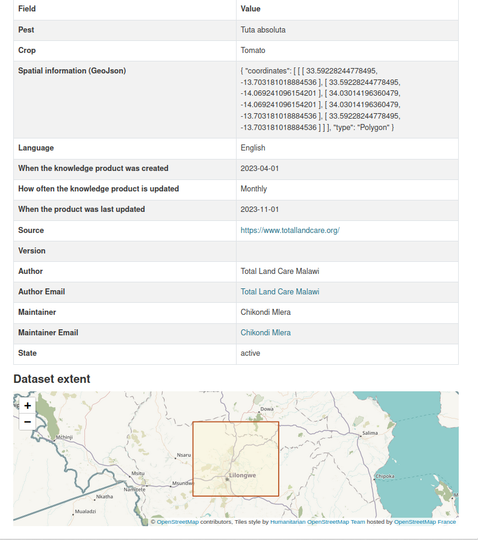
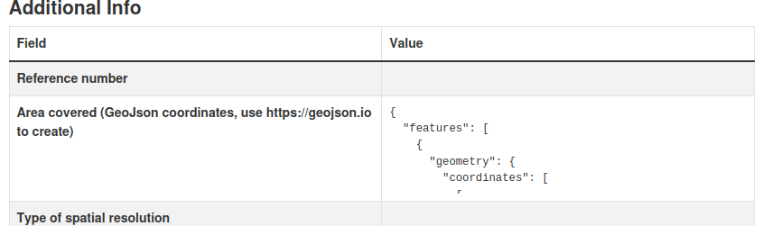
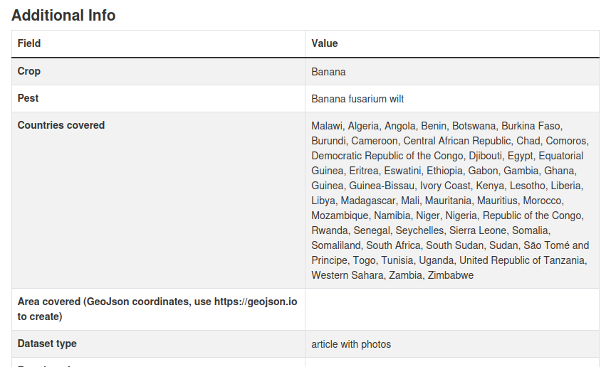

# ckanext-madiphstheming
Last edited 2024-07-04 by Tor-Einar Skog

This extension contains the UI modifications for [https://ckan.madiphs.org](https://ckan.madiphs.org). We have been using [This guide](https://docs.ckan.org/en/2.10/theming/templates.html) to create it.

## Frontpage modifications
The main file in the ckanext-madiphstheming plugin is `ckanext/madiphstheming/templates/home/madiphs_frontpage_contents.html` . Here we control what’s inside the `` of the `index.html` template.

## Modifications of the dataset view
### Map for spatial extent
To display a map showing the spatial extent of the dataset (illustrated below), we have modified the template for rendering
the dataset view.

The modification relies on the ckanext-spatial plugin and its support for a field in the dataset by convention called "spatial". Since we have a "spatial" field in our own schemas, we have had to add support for that too.

See the read.html file

### GeoJson view template

For the area covered property of the datasets, a long GeoJson text is to be displayed. To make the field scrollable, a display snippet `ckanext/templates/scheming/display_snippets/madiphsteaming_geojson.html` has been created. It is referenced in the [CKAN-Metadata schema file for factsheets](https://github.com/MaDiPHS/CKAN-Metadata/blob/main/ckanext-scheming/factsheets-schema.yaml)

### Countries covered template
To display the countries more space efficiently, a display snippet `ckanext/templates/scheming/display_snippets/madiphsteaming_country_codes.html` has been created. It is referenced in the [CKAN-Metadata schema file for factsheets](https://github.com/MaDiPHS/CKAN-Metadata/blob/main/ckanext-scheming/factsheets-schema.yaml)

### Avoid the slugged name of our dataset types
By default in the search page, the heading is something like this "[X] plant-health-knowledge-products found". We have fixed the slugging by overriding the `ckanext/templates/snippets/search_result_text.html` template.

### Open resource URLs in new window from resource page
On the resource view page, the links to the external resource opens in the same window by default. To change this, we have overridden the `ckanext/templates/package/resource_read.html` template.

## Requirements

Compatibility with core CKAN versions:

| CKAN version    | Compatible?   |
| --------------- | ------------- |
| 2.9 and earlier | not tested    |
| 2.10            | yes           |

Plugins required:
* [ckanext-spatial](https://github.com/ckan/ckanext-spatial)

## Installation

To install ckanext-madiphstheming:

1. Activate your CKAN virtual environment, for example:

     . /usr/lib/ckan/default/bin/activate

2. Clone the source and install it on the virtualenv

    git clone https://github.com/treinar/ckanext-madiphstheming.git
    cd ckanext-madiphstheming
    pip install -e .
	pip install -r requirements.txt

3. Add `madiphstheming` to the `ckan.plugins` setting in your CKAN
   config file (by default the config file is located at
   `/etc/ckan/default/ckan.ini`).

4. Restart CKAN. For example if you've deployed CKAN with nginx on Ubuntu:

     sudo systemctl reload nginx

## Config settings

None at present

## Developer installation

To install ckanext-madiphstheming for development, activate your CKAN virtualenv and
do:

    git clone https://github.com/treinar/ckanext-madiphstheming.git
    cd ckanext-madiphstheming
    python setup.py develop
    pip install -r dev-requirements.txt

## Tests

**Currently (2024-02-19) the tests are failing**

To run the tests, do:

    pytest --ckan-ini=test.ini

## License

[AGPL](https://www.gnu.org/licenses/agpl-3.0.en.html)
